# Adversary Emulation & Detection Lab

### Building a SOC Home Lab — Splunk SIEM, Sysmon Telemetry & Atomic Red Team Emulation

**Prepared by: Robiul Awoul**

---

## Objective

This report documents an end-to-end adversary-emulation and detection exercise. A two-machine virtual lab is built, a Windows victim is instrumented with Sysmon and a Splunk Universal Forwarder, five MITRE ATT&CK techniques are executed with Atomic Red Team, and each is detected in Splunk using behaviour-based search queries. The report covers infrastructure setup, Splunk and Sysmon configuration, log forwarding, the attacks, the detection SPL queries, and the most useful Sysmon Event ID for each detection.

## Lab Environment

The lab uses Oracle VirtualBox with an isolated NAT network (`192.168.11.0/24`):

| Host | Role | Operating System | IP Address | Key Software |
|------|------|------------------|------------|--------------|
| Kali Linux | Control & SIEM | Kali Linux | `192.168.11.131` | Splunk Enterprise (web 8000, mgmt 8089, receiving 9997) |
| Windows Server | Victim & Telemetry | Windows Server 2019 | `192.168.11.129` | Sysmon, Splunk Universal Forwarder, Invoke-AtomicRedTeam |

## Virtual Machine Specification

| VM | CPU (Core) | RAM (GB) | Network Type |
|----|-----------|----------|--------------|
| Kali or Ubuntu Server | 2 | 4 | NAT |
| Windows Server 2019 | 2 | 4 | NAT |

*Remarks: this is the minimum requirement. For better performance, increase the allocated RAM.*

## Software & Download Links

- VMware Workstation Pro — https://access.broadcom.com/default/ui/v1/signin/
- Oracle VirtualBox — https://www.virtualbox.org/
- Kali Linux — https://www.kali.org/get-kali/#kali-platforms
- Ubuntu Server — https://ubuntu.com/download/server
- Windows Server 2019 — https://www.microsoft.com/en-us/evalcenter/evaluate-windows-server-2019
- Sysmon — https://learn.microsoft.com/en-us/sysinternals/downloads/sysmon
- Sysmon config (Wazuh) — https://wazuh.com/resources/blog/emulation-of-attack-techniques-and-detection-with-wazuh/sysmonconfig.xml
- Invoke-AtomicRedTeam docs — https://www.atomicredteam.io/docs/invoke-atomicredteam
- MITRE ATT&CK — https://attack.mitre.org/

---

## Part 1 — The Infrastructure Setup

### Lab Network Diagram

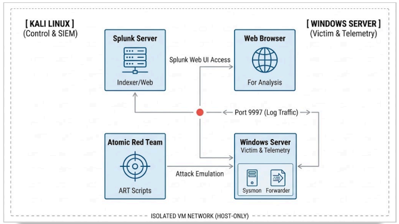

> **Figure 1.** Lab network architecture — Kali Linux running Splunk Enterprise (SIEM/indexer) and a Windows Server 2019 victim instrumented with Sysmon and the Splunk Universal Forwarder, on an isolated VirtualBox NAT network; Sysmon telemetry is forwarded to Splunk over port 9997.

The lab runs two virtual machines on an isolated VirtualBox NAT network (`192.168.11.0/24`). Kali Linux (`192.168.11.131`) hosts Splunk Enterprise as the SIEM/indexer. Windows Server 2019 (`192.168.11.129`) is the instrumented victim running Sysmon, a Splunk Universal Forwarder, and Atomic Red Team (the attack toolkit). Sysmon telemetry flows from the Windows Server to Splunk over port 9997, and analysis is performed through Splunk Web (port 8000).

### Kali Linux Settings

*Kali (or Ubuntu Server) VM — 2 vCPU, 4 GB RAM, NAT network adapter. This is the control / SIEM host running Splunk Enterprise.*

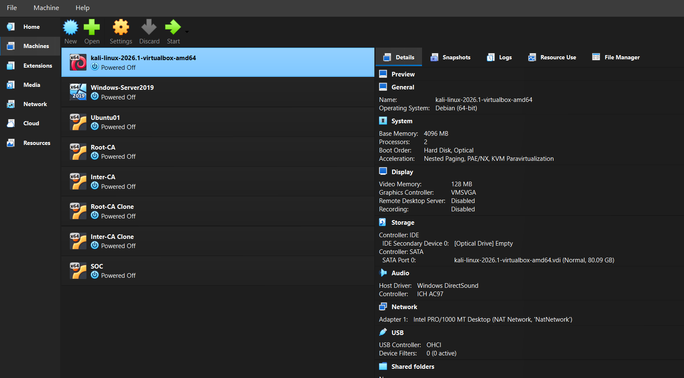

> **Figure 2.** VirtualBox Manager — Kali Linux VM details (Debian 64-bit, 4096 MB RAM, 2 CPUs), Adapter 1 attached to the NAT Network 'NatNetwork'.

### Windows Server Settings

*Windows Server 2019 VM — 2 vCPU, 4 GB RAM, NAT network adapter. This is the victim / telemetry host (Sysmon + Universal Forwarder + Atomic Red Team).*

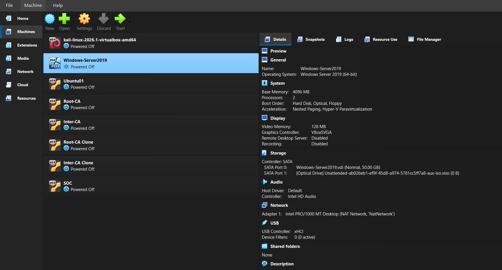

> **Figure 3.** VirtualBox Manager — Windows Server 2019 VM details (4096 MB RAM, 2 CPUs, 50 GB disk), Adapter 1 attached to the NAT Network 'NatNetwork'.

### Network settings of Kali Linux

Kali Linux is assigned `192.168.11.131`. Verify with:

```bash
ip addr        # or: ifconfig
```

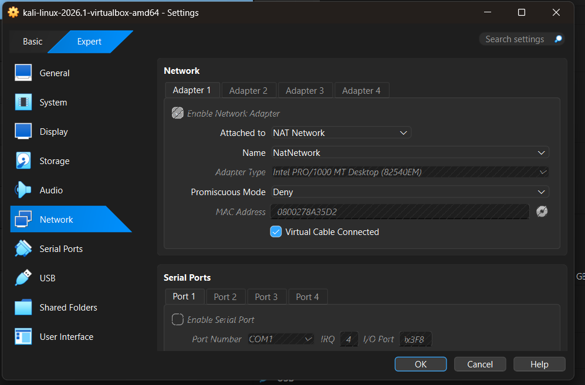

> **Figure 4.** Kali Linux VM network settings — Adapter 1 attached to the NAT Network 'NatNetwork', placing both VMs on the same isolated lab subnet.

### Network settings of Windows Server

Windows Server is assigned `192.168.11.129` on the same NAT subnet, with the Kali Splunk server reachable on ports 9997 (data) and 8089 (management). Verify with:

```powershell
ipconfig /all
```

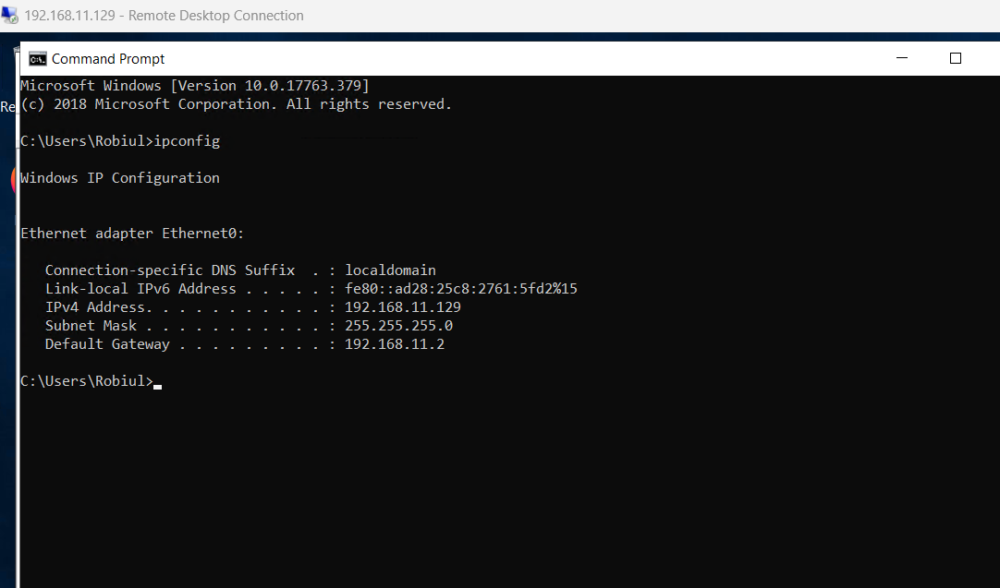

> **Figure 5.** Windows Server connectivity check — hostname Robiul-60004 and the ipconfig output showing the server IP address, subnet mask and default gateway.

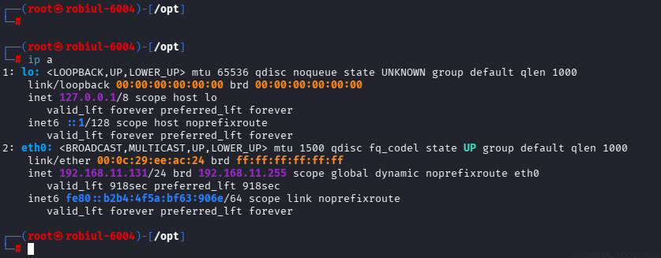

> **Figure 6.** Kali Linux network verification — the 'ip a' command showing the eth0 interface and its IPv4 address.

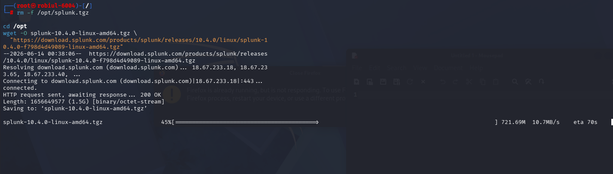

> **Figure 7.** Installing Splunk on Kali — downloading the Splunk Enterprise 10.4.0 package with wget from download.splunk.com.

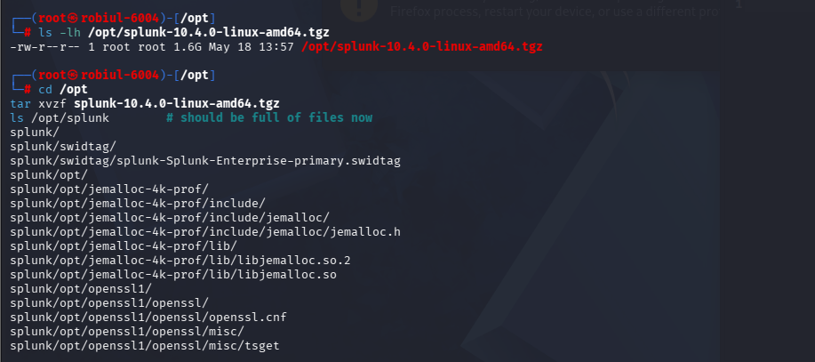

> **Figure 8.** Installing Splunk on Kali — extracting the Splunk tarball into /opt and listing the install directory to confirm success.

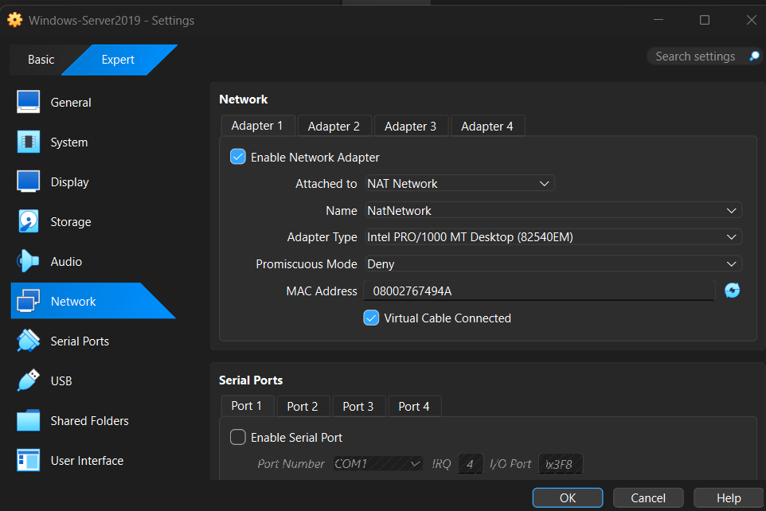

> **Figure 9.** Windows Server VM network settings — Adapter 1 attached to the NAT Network 'NatNetwork'.

---

## Part 2 — Install Splunk Enterprise on Kali Linux

Kali Linux (`192.168.11.131`) acts as the SIEM. Create a free Splunk account, download the Splunk Enterprise Linux package, then install and start it.

### 2.1 Install Splunk

```bash
cd ~/Downloads
sudo tar xvzf splunk-*-linux-amd64.tgz -C /opt    # installs to /opt/splunk
# (.deb alternative: sudo dpkg -i splunk-*-linux-amd64.deb)
```

### 2.2 Start Splunk and set the admin account

```bash
sudo /opt/splunk/bin/splunk start --accept-license
sudo /opt/splunk/bin/splunk enable boot-start -user root
```

Splunk Web is now reachable at `http://192.168.11.131:8000`. Log in with the admin credentials you set during start-up.

### 2.3 Enable receiving on port 9997

So forwarders can send data, enable the receiving port (CLI or Web UI):

```bash
sudo /opt/splunk/bin/splunk enable listen 9997 -auth admin:<password>
```

*Web UI equivalent: Settings → Forwarding and receiving → Configure receiving → New Receiving Port → 9997.*

### 2.4 Create the index

Create a dedicated index named `win` to hold all Windows telemetry:

```bash
sudo /opt/splunk/bin/splunk add index win -auth admin:<password>
```

*Web UI equivalent: Settings → Indexes → New Index → name it `win`.*

Figures 10–14 show the Splunk web interface, the receiving-port configuration, and the initial Sysmon installation on the Windows Server.

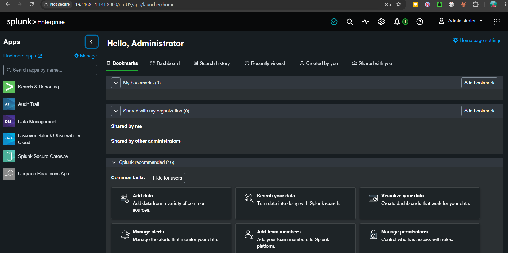

> **Figure 10.** Splunk Enterprise web interface (`192.168.11.131:8000`) signed in as Administrator, confirming the SIEM is running on Kali.

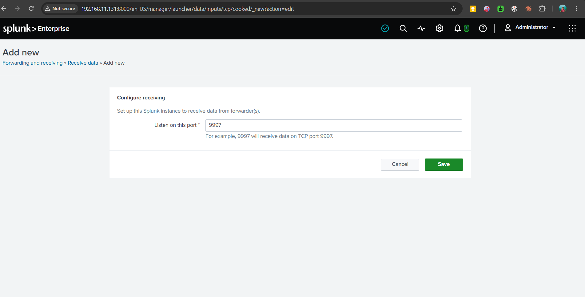

> **Figure 11.** Enabling data reception in Splunk — configuring receiving port 9997 so the Universal Forwarder can send Windows telemetry to the indexer.

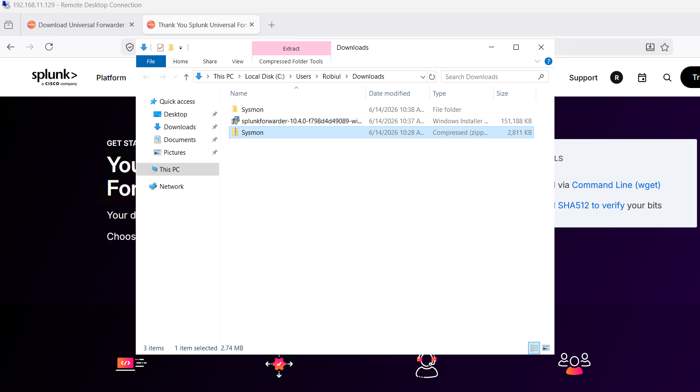

> **Figure 12.** Windows Server (via RDP, `192.168.11.129`) — the downloaded Splunk Universal Forwarder 10.4.0 installer and the Sysmon package.

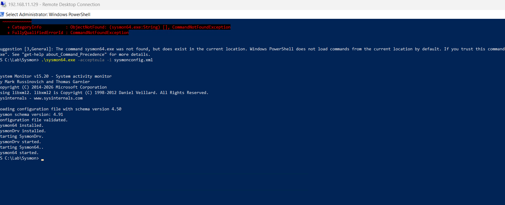

> **Figure 13.** Installing Sysmon on the Windows Server — `sysmon64.exe -accepteula -i sysmonconfig.xml` (System Monitor v15.20) installing the service and driver with the Wazuh configuration.

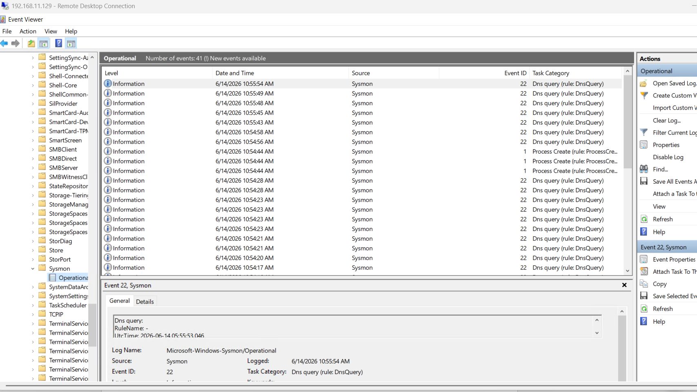

> **Figure 14.** Windows Event Viewer — the Microsoft-Windows-Sysmon/Operational log populated with events (Event ID 22 DNS query and Event ID 1 Process Create), confirming Sysmon telemetry.

---

## Part 3 — Sysmon & Splunk Universal Forwarder (Windows Server)

### 3.1 Install and configure Sysmon

Download Sysmon from Sysinternals and a detection-focused configuration (the Wazuh `sysmonconfig.xml` referenced in the task sheet). Place both files in `C:\Lab\Sysmon`, then in an elevated PowerShell:

```powershell
cd C:\Lab\Sysmon
.\sysmon64.exe -accepteula -i sysmonconfig.xml
```

Verify the driver and service are running, and reload the config later with `-c` if you edit it:

```powershell
Get-Service Sysmon64
.\sysmon64.exe -c sysmonconfig.xml
```

Sysmon now writes to the Microsoft-Windows-Sysmon/Operational event log (Event ID 1 process create, 3 network, 10 process access, 11 file create, 13 registry set, etc.).

### 3.2 Install the Splunk Universal Forwarder

Download and run the Splunk Universal Forwarder MSI. During setup choose “An on-premises Splunk Enterprise instance”, and point the Receiving Indexer / Deployment Server at the Kali Splunk server: `192.168.11.131` (receiving 9997, management 8089). Set an admin username and password when prompted.

You can also wire the forwarder from the command line:

```powershell
cd "C:\Program Files\SplunkUniversalForwarder\bin"
.\splunk.exe add forward-server 192.168.11.131:9997 -auth admin:<password>
```

### 3.3 Configure inputs (Sysmon, PowerShell, Security)

Create an `inputs.conf` that forwards the relevant Windows event channels into the `win` index. Place it at `C:\Program Files\SplunkUniversalForwarder\etc\apps\TA-local-sysmon\local\inputs.conf`:

```ini
[WinEventLog://Microsoft-Windows-Sysmon/Operational]
disabled = 0
index = win
renderXml = true

[WinEventLog://Microsoft-Windows-PowerShell/Operational]
disabled = 0
index = win
renderXml = true

[WinEventLog://Security]
disabled = 0
index = win
```

Restart the forwarder and confirm the monitored inputs:

```powershell
.\splunk.exe restart
.\splunk.exe list monitor
```

Figures 15–23 document the Universal Forwarder installation, its connection to the indexer on port 9997, and confirmation that the `win` index is receiving events.

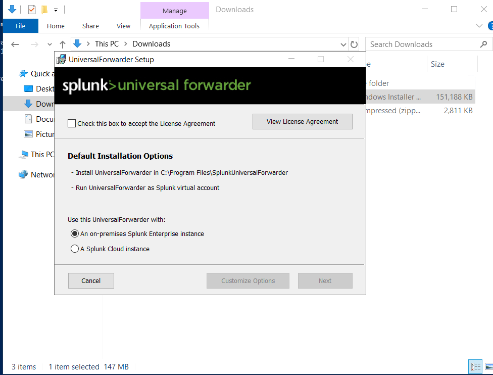

> **Figure 15.** Splunk Universal Forwarder Setup — accepting the licence and selecting the on-premises Splunk Enterprise deployment type.

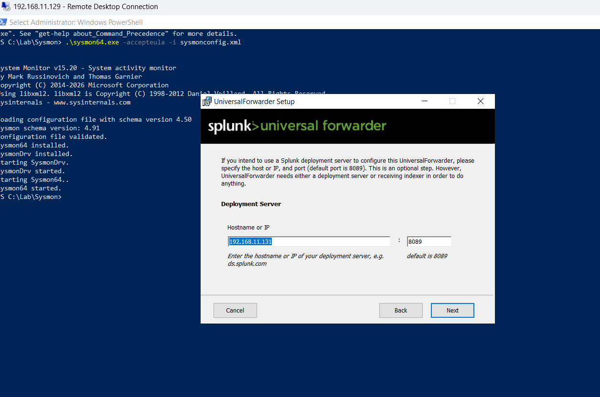

> **Figure 16.** Universal Forwarder Setup — pointing the Deployment Server at the Kali Splunk host `192.168.11.131:8089`.

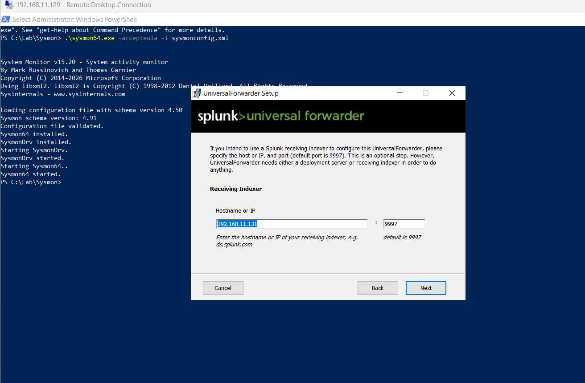

> **Figure 17.** Universal Forwarder Setup — pointing the Receiving Indexer at the Kali Splunk host `192.168.11.131:9997`.

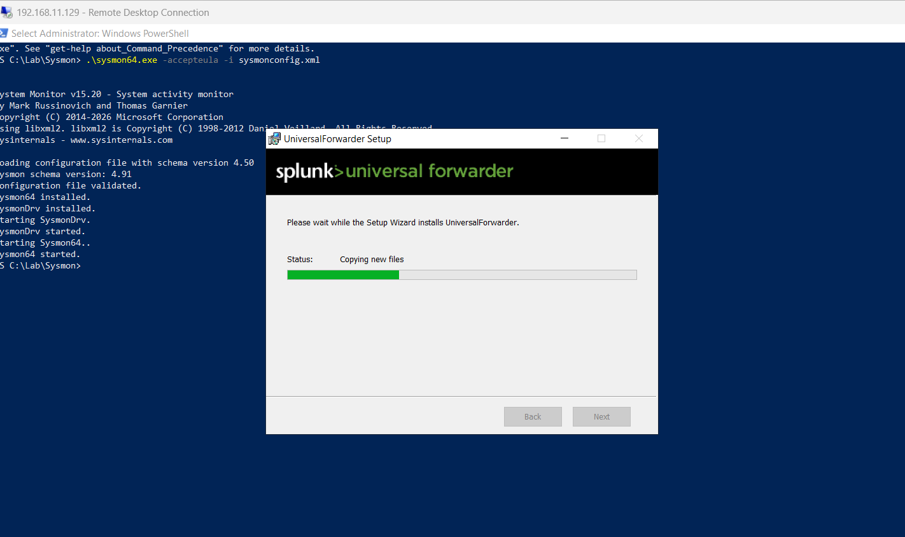

> **Figure 18.** Universal Forwarder Setup — installation in progress.

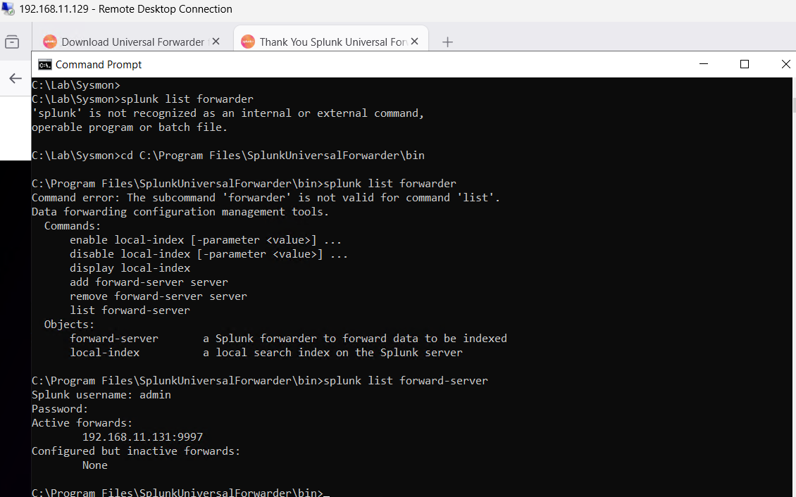

> **Figure 19.** Verifying the forwarder connection — `splunk list forward-server` shows an active forward to `192.168.11.131:9997`.

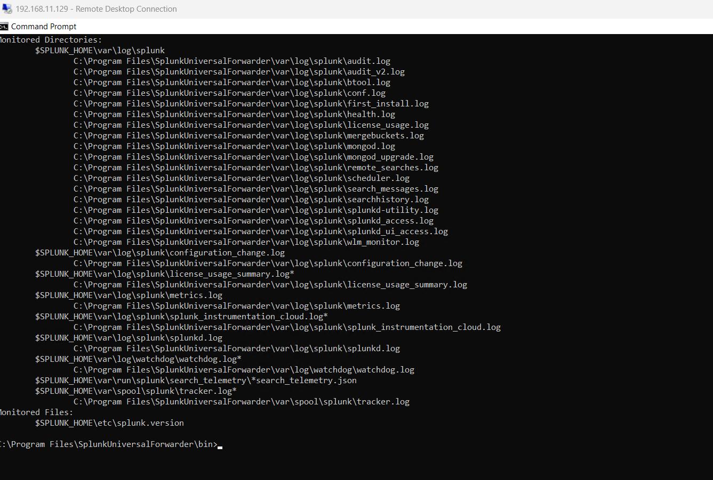

> **Figure 20.** Verifying forwarder inputs — `splunk list monitor` listing the monitored directories and files.

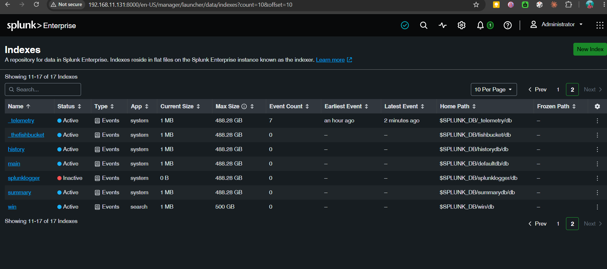

> **Figure 21.** Splunk Indexes page — the dedicated `win` index created and active (event count 0, before the attacks).

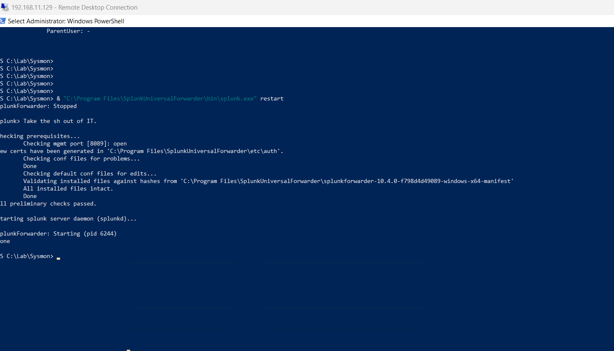

> **Figure 22.** Restarting the Universal Forwarder — `splunk.exe restart`, with management port 8089 confirmed open.

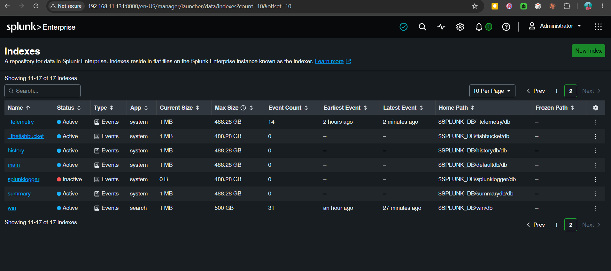

> **Figure 23.** Splunk Indexes page — the `win` index now showing ingested events, confirming Windows telemetry is reaching the indexer.

---

## Part 4 — Verify Telemetry & Splunk Dashboard

With Sysmon generating logs and the Universal Forwarder shipping them to Kali, confirm the data is being indexed. On the Splunk server install the Splunk Add-on for Sysmon (Settings → Apps → Browse more apps, or Install app from file) so the raw Sysmon XML is parsed into searchable fields.

### 4.1 Confirm events are arriving

In Splunk Web (`http://192.168.11.131:8000`) run the following over the Last 24 hours:

```spl
index=win | stats count by host, sourcetype
```

The Windows Server host appears with sourcetype `XmlWinEventLog`, confirming end-to-end ingestion over port 9997.

### 4.2 Confirm Sysmon and PowerShell channels

```spl
index=win source="XmlWinEventLog:Microsoft-Windows-Sysmon/Operational" | stats count by EventCode

index=win source="XmlWinEventLog:Microsoft-Windows-PowerShell/Operational" | stats count by EventCode
```

Confirm which Sysmon event types are arriving by breaking the `win` index down by Event ID. In Splunk Web → Search, set the time range to All time and run:

```spl
index=win | stats count by EventCode
```

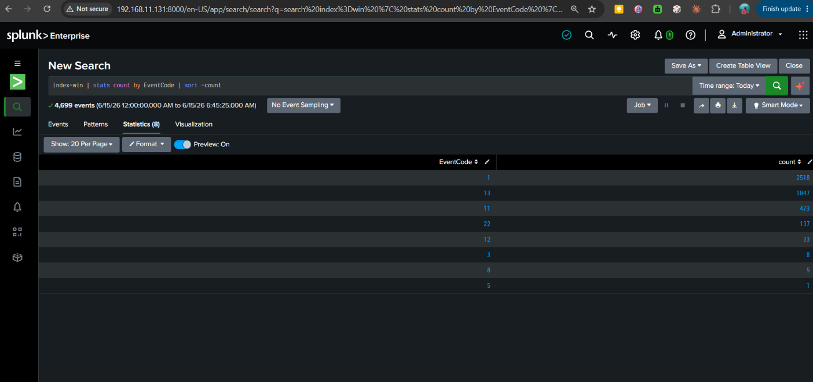

> **Figure 24.** Event ID distribution in the win index — `index=win | stats count by EventCode` shows Sysmon Event ID 1 (process create) and Event ID 13 (registry set) dominating, confirming rich telemetry.

List the process-creation events (Event ID 1) to confirm full command-line telemetry is captured:

```spl
index=win EventCode=1 | table _time, Computer, Image, CommandLine
```

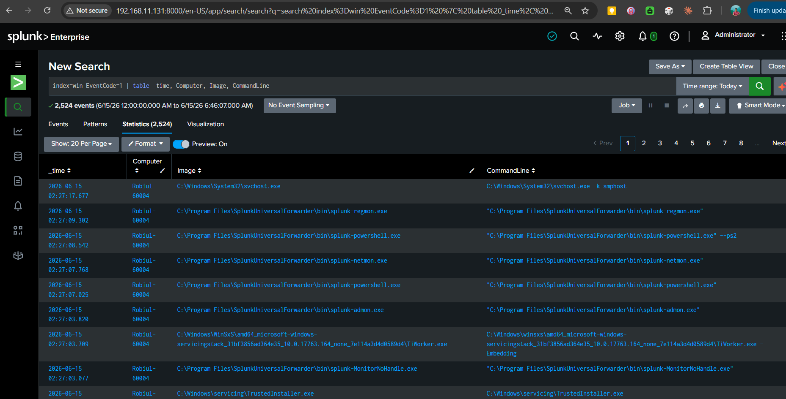

> **Figure 25.** Process-creation telemetry (Sysmon Event ID 1) in Splunk — `index=win EventCode=1` returns thousands of process events from host Robiul-60004.

### 4.3 Build a monitoring dashboard

Save the verification searches as dashboard panels (Search → Save As → Dashboard Panel) to produce a live view of Windows Server activity: an Events-over-Time timechart, a top-EventCodes bar chart, and a recent-process-creation table. This satisfies deliverable #3 — a Splunk Dashboard showing active logs from the Windows Server.

```spl
index=win source="XmlWinEventLog:Microsoft-Windows-Sysmon/Operational" | timechart count by EventCode
```

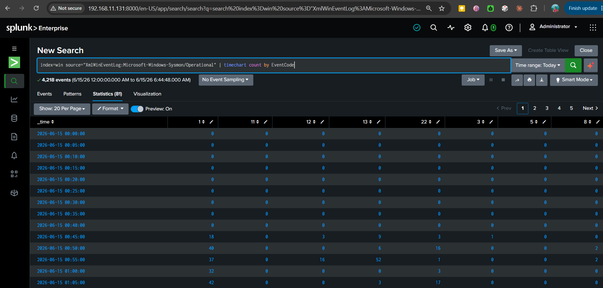

> **Figure 26.** Dashboard panel — Sysmon events over time grouped by Event ID (`index=win | timechart count by EventCode`), the basis for the live monitoring dashboard.

Figures 24–29 show the Event ID distribution, process-creation telemetry, the events-over-time timechart, the end-to-end verification search, the forwarder input configuration, and the Atomic Red Team setup on the victim.

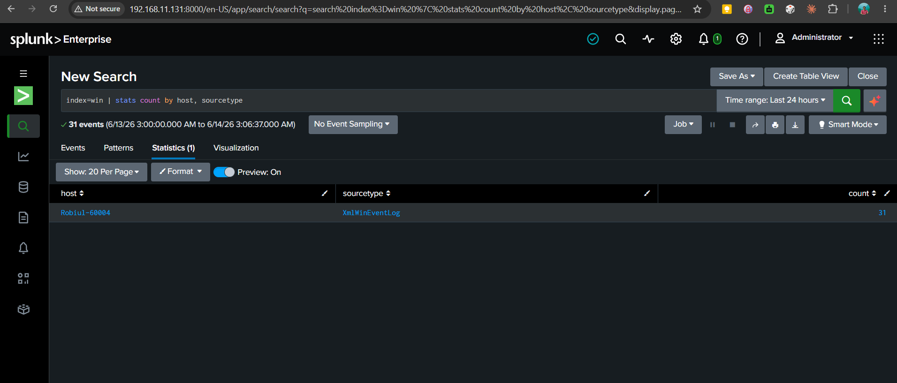

> **Figure 27.** End-to-end verification in Splunk — `index=win | stats count by host, sourcetype` returns host Robiul-60004 with sourcetype XmlWinEventLog.

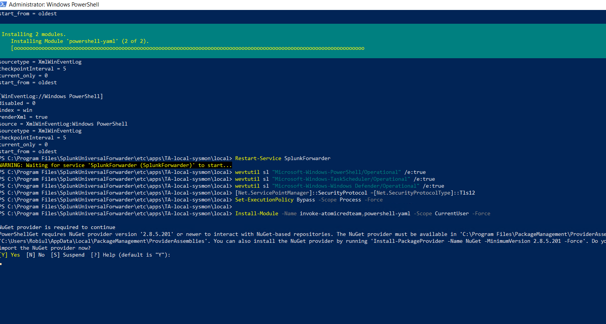

> **Figure 28.** Configuring forwarder inputs — the TA-local-sysmon app inputs.conf stanzas, restarting the forwarder, and enabling the PowerShell, Task Scheduler and Defender operational logs with wevtutil.

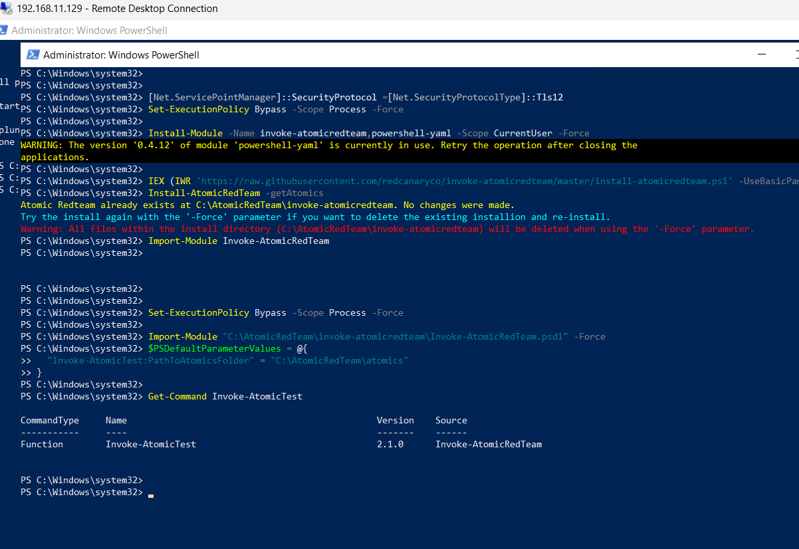

> **Figure 29.** Installing Atomic Red Team on the Windows Server — `Install-AtomicRedTeam -getAtomics`, importing the module, and confirming Invoke-AtomicTest (v2.1.0) is available.

---

## Part 5 — Install Invoke-AtomicRedTeam

Atomic Red Team is installed on the Windows Server 2019 victim. Open Windows PowerShell as Administrator and run:

```powershell
Set-ExecutionPolicy Bypass -Scope CurrentUser -Force
IEX (IWR 'https://raw.githubusercontent.com/redcanaryco/invoke-atomicredteam/master/install-atomicredteam.ps1' -UseBasicParsing)
Install-AtomicRedTeam -getAtomics -Force
Import-Module "C:\AtomicRedTeam\invoke-atomicredteam\Invoke-AtomicRedTeam.psd1" -Force
```

The atomic test definitions are installed to `C:\AtomicRedTeam\atomics`. Because several payloads are deliberately malicious, Windows Defender will quarantine them (seen in the lab as *“This script contains malicious content and has been blocked by your antivirus software”*). For the lab only, add an exclusion so the tests can run:

```powershell
Add-MpPreference -ExclusionPath "C:\AtomicRedTeam"
```

---

## Part 6 — The Attack (Red Team)

Each technique is first listed with `-ShowDetailsBrief`, then executed with `Invoke-AtomicTest`. Use `-GetPrereqs` to download any required tools (e.g. procdump), and `-Cleanup` afterwards to revert changes. Run every command in an elevated PowerShell session.

### 6.1 T1053.005 — Scheduled Task (Persistence)

```powershell
Invoke-AtomicTest T1053.005 -ShowDetailsBrief
Invoke-AtomicTest T1053.005 -TestNumbers 1
```

*Creates a scheduled task that runs a hidden script. (Test 1 — Scheduled Task Startup Script.)*

### 6.2 T1218.005 — MSHTA (Defense Evasion)

```powershell
Invoke-AtomicTest T1218.005 -ShowDetailsBrief
Invoke-AtomicTest T1218.005 -TestNumbers 1
```

*Uses mshta.exe to execute a remote .hta payload, bypassing application control. (Test 1 — Mshta executes JavaScript Scheme Fetch Remote Payload.)*

### 6.3 T1003.001 — LSASS Dumping (Credential Access)

```powershell
Invoke-AtomicTest T1003.001 -ShowDetailsBrief
Invoke-AtomicTest T1003.001 -TestNumbers 1 -GetPrereqs
Invoke-AtomicTest T1003.001 -TestNumbers 1
```

*Uses procdump to dump LSASS memory and steal credentials. (Test 1 — Dump LSASS.exe Memory using ProcDump.)*

### 6.4 T1059.001 — PowerShell Download (Execution)

```powershell
Invoke-AtomicTest T1059.001 -ShowDetailsBrief
Invoke-AtomicTest T1059.001 -TestNumbers 1
```

*Downloads and executes a script from the web using a PowerShell download cradle.*

### 6.5 T1112 — Modify Registry (Defense Evasion)

```powershell
Invoke-AtomicTest T1112 -ShowDetailsBrief
Invoke-AtomicTest T1112 -TestNumbers 3,5
```

Writes attacker-controlled registry values — e.g. storing logon credentials (Test 3) and adding a domain to the Internet Explorer Trusted-Sites zone (Test 5). The same technique is also used to disable security tooling such as Windows Defender.

Cleanup after testing (run for each technique):

```powershell
Invoke-AtomicTest T1053.005,T1218.005,T1003.001,T1059.001,T1112 -Cleanup
```

Figures 30–37 capture each technique being listed and executed on the Windows Server, including the payloads blocked by Windows Defender.

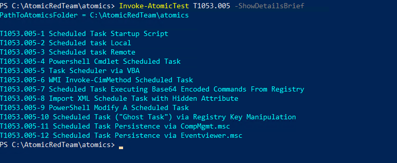

> **Figure 30.** Listing the scheduled-task tests — `Invoke-AtomicTest T1053.005 -ShowDetailsBrief` enumerates the available atomic variants.

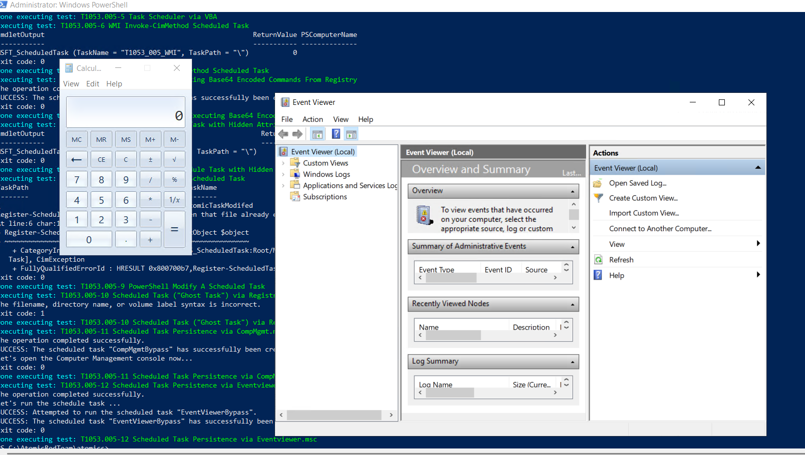

> **Figure 31.** Executing T1053.005 (Scheduled Task) — persistence variants run successfully; a task-spawned Calculator window is visible on the victim.

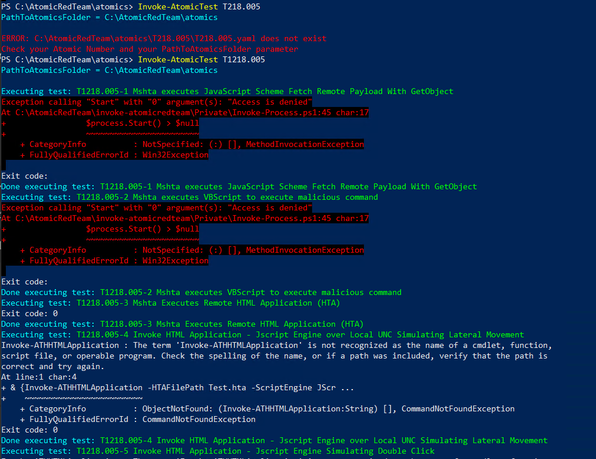

> **Figure 32.** Executing T1218.005 (MSHTA) — mshta.exe variants invoking remote/inline script payloads; some are blocked ('Access is denied').

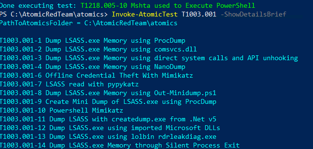

> **Figure 33.** Listing the LSASS-dumping tests — `Invoke-AtomicTest T1003.001 -ShowDetailsBrief` enumerates the available atomic variants.

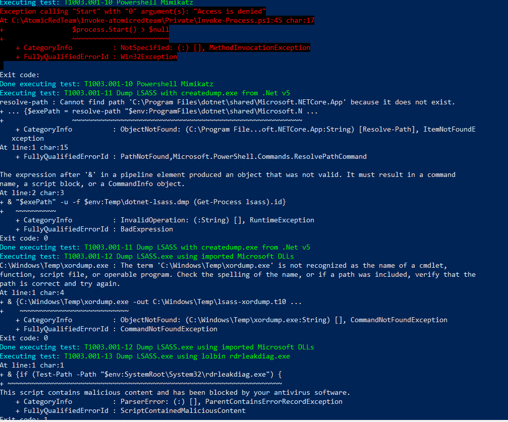

> **Figure 34.** Executing T1003.001 (LSASS Dumping) — credential-access tools such as Mimikatz, createdump and rdrleakdiag; several payloads are quarantined by Windows Defender.

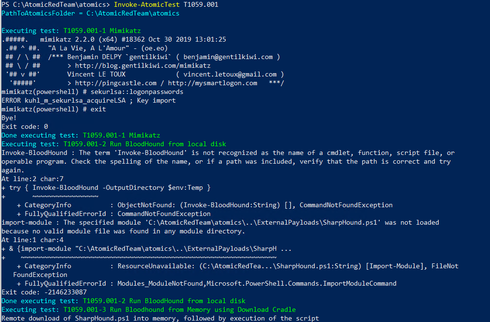

> **Figure 35.** Executing T1059.001 (PowerShell) — Mimikatz, BloodHound and a SharpHound download cradle executed from memory.

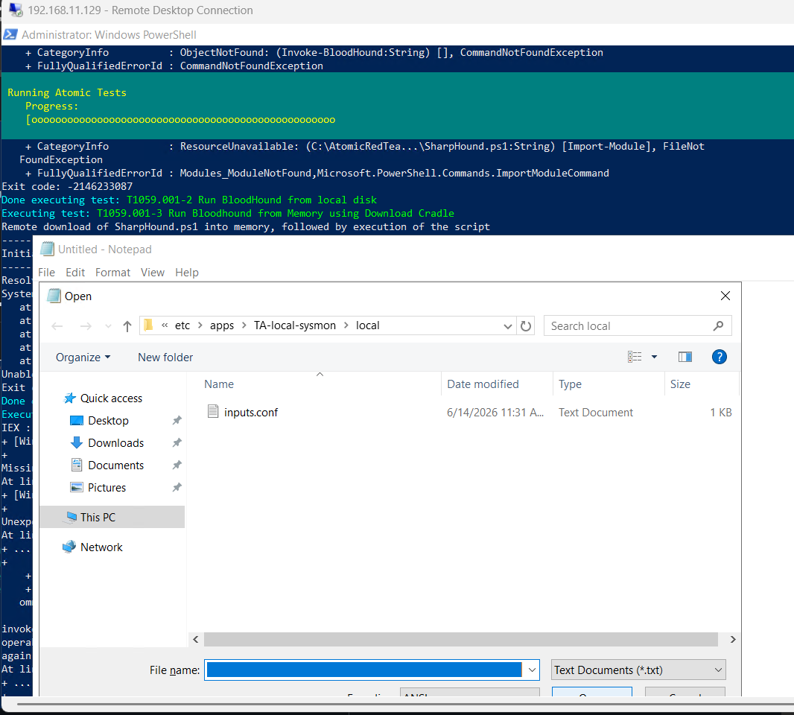

> **Figure 36.** Atomic test execution in progress on the Windows Server, alongside the TA-local-sysmon app inputs.conf file.

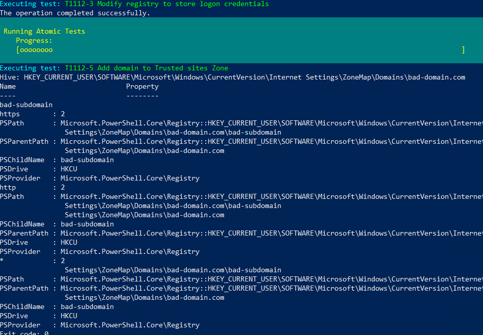

> **Figure 37.** Executing T1112 (Modify Registry) — atomic tests writing registry values: storing logon credentials and adding a domain to the Internet Explorer Trusted-Sites zone.

---

## Part 7 — The Detection (Blue Team)

Logging into Splunk Web on Kali (`http://192.168.11.131:8000`), each of the five attacks is hunted using behaviour-based SPL — never by searching for the word “Atomic”. The Splunk Add-on for Sysmon (`Splunk_TA_microsoft_sysmon`) parses the raw XML into named fields (Image, CommandLine, ParentImage, TargetImage, TargetObject, GrantedAccess), so every query below returns the Process Name, Command Line, and Time of the activity. Set the time range to cover when the attacks were run.

Before drilling into each technique, confirm the attacker tools were captured by grouping process-create events by image:

```spl
index=win EventCode=1 (Image="*schtasks.exe" OR Image="*mshta.exe" OR Image="*powershell.exe" OR Image="*reg.exe" OR Image="*cmd.exe") | stats count by Image
```

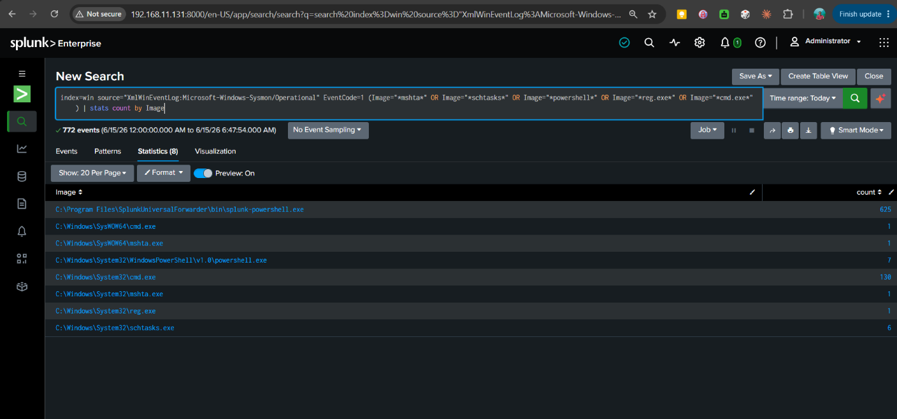

> **Figure 38.** Overview of attack-related processes captured by Sysmon Event ID 1 — schtasks.exe, mshta.exe, powershell.exe, reg.exe and cmd.exe across the five techniques.

### 7.1 T1053.005 — Scheduled Task (Persistence)

Detect creation of a scheduled task via the schtasks.exe process and its `/create` command line.

```spl
index=win source="XmlWinEventLog:Microsoft-Windows-Sysmon/Operational" EventCode=1 Image="*\\schtasks.exe" CommandLine="*/create*"
| table _time, Computer, User, Image, CommandLine, ParentImage
```

*Most useful Event ID: Sysmon Event ID 1 (Process Create). It exposes schtasks.exe and the full task-creation command line. Windows Security Event ID 4698 ("A scheduled task was created") corroborates the persistence object.*

Running the §7.1 query over the attack time window returns the scheduled-task creations — schtasks.exe with `/create` spawning the payload:

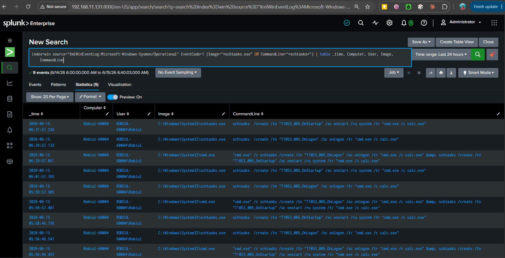

> **Figure 39.** Detection of T1053.005 in Splunk — the Sysmon Event ID 1 search returns schtasks.exe /create commands (T1053_005_OnStartup and OnLogon, spawning calc.exe) on host Robiul-60004.

### 7.2 T1218.005 — MSHTA (Defense Evasion)

Detect mshta.exe executing a remote .hta / inline script to bypass application control.

```spl
index=win source="XmlWinEventLog:Microsoft-Windows-Sysmon/Operational" EventCode=1 Image="*\\mshta.exe"
| table _time, Computer, User, Image, CommandLine, ParentImage
```

*Most useful Event ID: Sysmon Event ID 1 (Process Create). The mshta.exe command line reveals the remote .hta URL or javascript: payload, and ParentImage shows what launched it.*

Running the §7.2 query returns the MSHTA executions — mshta.exe invoking the remote .hta payload:

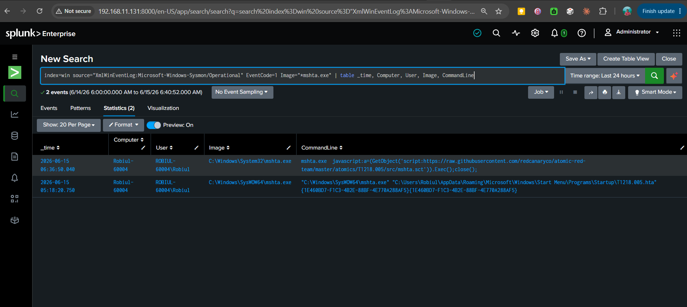

> **Figure 40.** Detection of T1218.005 in Splunk — the Sysmon Event ID 1 search returns mshta.exe executing a remote .hta / javascript: payload from the Atomic Red Team repository.

### 7.3 T1003.001 — LSASS Memory Dumping (Credential Access)

Detect a process opening LSASS memory (e.g. procdump) to steal credentials.

```spl
index=win source="XmlWinEventLog:Microsoft-Windows-Sysmon/Operational" EventCode=10 TargetImage="*\\lsass.exe"
| table _time, Computer, SourceImage, TargetImage, GrantedAccess, CallTrace
```

*Most useful Event ID: Sysmon Event ID 10 (Process Access). A non-system SourceImage opening lsass.exe with GrantedAccess such as 0x1010 or 0x1410 is the genuine credential-theft behaviour — far more reliable than matching the tool name.*

### 7.4 T1059.001 — PowerShell Download Cradle (Execution)

Detect PowerShell downloading and executing a remote script.

```spl
index=win source="XmlWinEventLog:Microsoft-Windows-Sysmon/Operational" EventCode=1 Image="*\\powershell.exe" (CommandLine="*DownloadString*" OR CommandLine="*Net.WebClient*" OR CommandLine="*Invoke-WebRequest*" OR CommandLine="*IEX*")
| table _time, Computer, User, Image, CommandLine, ParentImage
```

Alternative using PowerShell Script-Block logging:

```spl
index=win source="XmlWinEventLog:Microsoft-Windows-PowerShell/Operational" EventCode=4104 (ScriptBlockText="*DownloadString*" OR ScriptBlockText="*Net.WebClient*" OR ScriptBlockText="*IEX*")
| table _time, Computer, ScriptBlockText
```

*Most useful Event ID: Sysmon Event ID 1 (Process Create) for the command line, complemented by PowerShell Event ID 4104 (Script Block Logging), which captures the de-obfuscated download cradle.*

Running the §7.4 query returns the PowerShell download cradle — powershell.exe calling DownloadString to fetch and run a remote script:

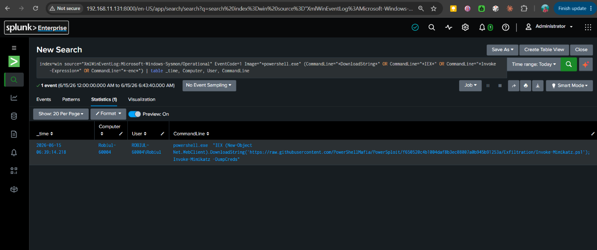

> **Figure 41.** Detection of T1059.001 in Splunk — the Sysmon Event ID 1 search returns powershell.exe running an IEX New-Object Net.WebClient.DownloadString cradle that fetches Invoke-Mimikatz.ps1.

### 7.5 T1112 — Modify Registry (Defense Evasion)

Detect suspicious registry value writes — Defender tamper keys, credential-storage keys, or Internet Explorer Trusted-Sites entries.

```spl
index=win source="XmlWinEventLog:Microsoft-Windows-Sysmon/Operational" EventCode=13 (TargetObject="*DisableAntiSpyware*" OR TargetObject="*DisableRealtimeMonitoring*" OR TargetObject="*ZoneMap*" OR TargetObject="*Winlogon*" OR TargetObject="*\\Windows Defender\\*")
| table _time, Computer, Image, TargetObject, Details
```

*Most useful Event ID: Sysmon Event ID 13 (Registry Value Set). It records the exact registry key and value written — Defender, credential-storage or Trusted-Sites keys — and the process that set it.*

Figures 39–41 show the live Splunk detections for the scheduled-task, MSHTA and PowerShell techniques; Figures 42–43 show the Splunk Add-on for Sysmon and an `index=win` detection search returning Windows telemetry from the victim.

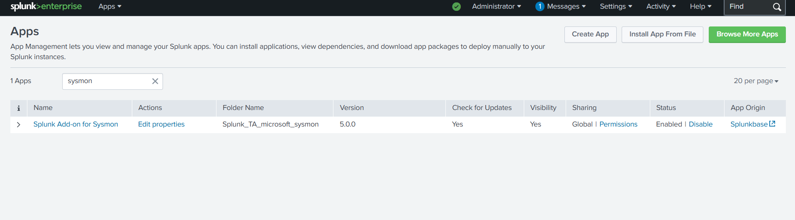

> **Figure 42.** Splunk Add-on for Sysmon (Splunk_TA_microsoft_sysmon, v5.0.0) installed and enabled on the Splunk server to parse Sysmon data into searchable fields.

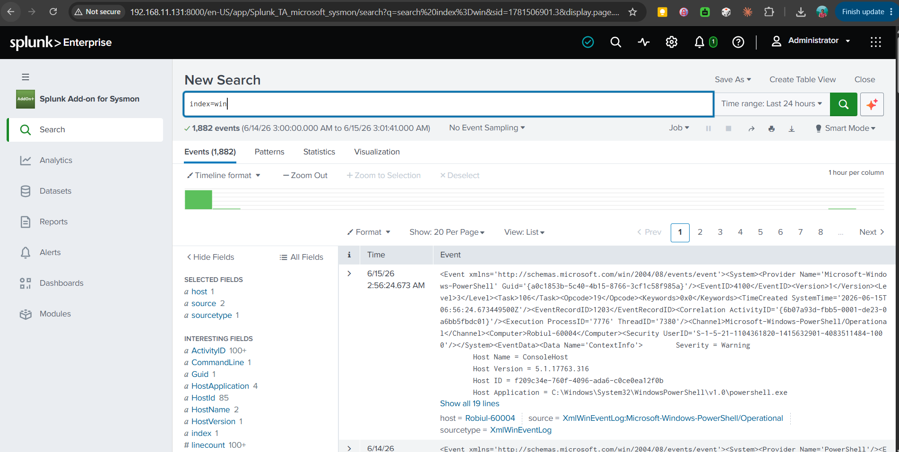

> **Figure 43.** Detection in Splunk — an `index=win` search returning 1,882 events, with an expanded PowerShell Operational event (Event ID 4100) from host Robiul-60004.

---

## Part 8 — Sysmon Event ID Summary & Conclusion

The assignment rule is explicit: detection must be based on actual technical behaviour (a specific Sysmon Event ID and command-line artefact), not on searching for the word “Atomic”. The table below records, for each of the five techniques, the Sysmon (or Windows) Event ID that proved most useful for detection and the reason it was decisive.

| Technique | Attack | Most Useful Event ID | Why it was decisive |
|-----------|--------|----------------------|---------------------|
| T1053.005 | Scheduled Task (Persistence) | Sysmon ID 1 (Process Create) | schtasks.exe spawned with a `/create` command line; Security ID 4698 confirms the task object. |
| T1218.005 | MSHTA (Defense Evasion) | Sysmon ID 1 (Process Create) | mshta.exe command line exposes the remote .hta / javascript: payload and its parent process. |
| T1003.001 | LSASS Dumping (Credential Access) | Sysmon ID 10 (Process Access) | A non-system process opening lsass.exe with GrantedAccess 0x1010/0x1410 is the true credential-theft signal. |
| T1059.001 | PowerShell Download (Execution) | Sysmon ID 1 + PowerShell 4104 | powershell.exe command line / script-block text shows the download cradle (DownloadString, IEX, Net.WebClient). |
| T1112 | Registry Modification (Defense Evasion) | Sysmon ID 13 (Registry Set) | Registry value writes (Defender tamper keys, credential-storage keys, or IE Trusted-Sites entries) are captured at the moment of modification. |

### Conclusion

This lab demonstrated a complete detection-engineering cycle. A two-VM environment was built in VirtualBox on an isolated NAT network: Kali Linux running Splunk Enterprise as the SIEM, and Windows Server 2019 as the instrumented victim. Sysmon provided rich process, network and registry telemetry, which the Splunk Universal Forwarder shipped to the indexer over port 9997 and the Splunk Add-on for Sysmon normalised for searching. Five MITRE ATT&CK techniques were emulated with Invoke-AtomicRedTeam, and each was independently detected in Splunk using behaviour-based SPL that surfaced the Process Name, Command Line, and Time of the activity.

### Final Deliverable / Submission

In line with the task sheet, this report together with all supporting screenshots is published to a public GitHub repository. The original formatted report is included as [`LAB-Assignment.docx`](LAB-Assignment.docx); this `README.md` reproduces it for in-browser reading, with all 43 screenshots in [`images/`](images/).

---

## List of Figures

1. Lab network architecture (Kali + Splunk; Windows Server + Sysmon/UF; NAT, port 9997)
2. VirtualBox Manager — Kali Linux VM details
3. VirtualBox Manager — Windows Server 2019 VM details
4. Kali Linux VM network settings (NAT)
5. Windows Server connectivity check (ipconfig)
6. Kali Linux network verification (ip a)
7. Installing Splunk on Kali — download (wget)
8. Installing Splunk on Kali — extract to /opt
9. Windows Server VM network settings (NAT)
10. Splunk Enterprise web interface signed in
11. Enabling data reception in Splunk (port 9997)
12. Universal Forwarder + Sysmon packages on the victim
13. Installing Sysmon (sysmon64.exe -i sysmonconfig.xml)
14. Sysmon Operational log populated in Event Viewer
15. Universal Forwarder Setup — licence / deployment type
16. Universal Forwarder Setup — Deployment Server
17. Universal Forwarder Setup — Receiving Indexer
18. Universal Forwarder Setup — installing
19. Verifying forwarder connection (list forward-server)
20. Verifying forwarder inputs (list monitor)
21. `win` index created and active
22. Restarting the Universal Forwarder
23. `win` index ingesting events
24. Event ID distribution in the win index
25. Process-creation telemetry (Event ID 1)
26. Dashboard panel — Sysmon events over time
27. End-to-end verification (host / sourcetype)
28. Configuring forwarder inputs (inputs.conf, wevtutil)
29. Installing Atomic Red Team on the victim
30. Listing scheduled-task tests (T1053.005)
31. Executing T1053.005 (Scheduled Task)
32. Executing T1218.005 (MSHTA)
33. Listing LSASS-dumping tests (T1003.001)
34. Executing T1003.001 (LSASS Dumping)
35. Executing T1059.001 (PowerShell)
36. Atomic test execution in progress
37. Executing T1112 (Modify Registry)
38. Overview of attack-related processes (Event ID 1)
39. Detection of T1053.005 (schtasks.exe /create)
40. Detection of T1218.005 (mshta.exe remote payload)
41. Detection of T1059.001 (PowerShell download cradle)
42. Splunk Add-on for Sysmon installed
43. `index=win` detection search (1,882 events)
